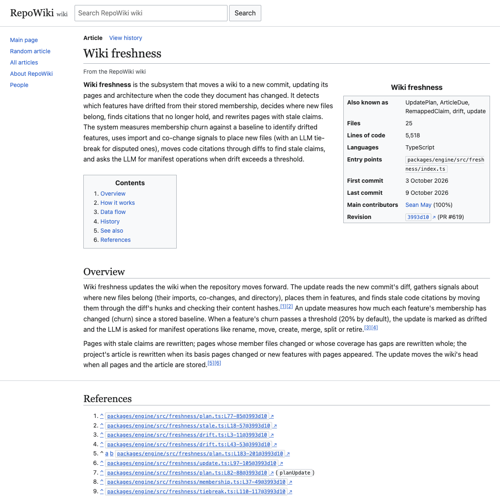
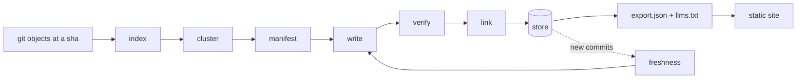

# RepoWiki

RepoWiki reads a git repository's source and history and writes a Wikipedia-style wiki for it, one article per feature, where every body claim cites the code lines or commit it rests on.

**Wiki:** [seanpatrickmay.me/wiki/repowiki](https://seanpatrickmay.me/wiki/repowiki/) · **All generated wikis:** [seanpatrickmay.me/wiki](https://seanpatrickmay.me/wiki/) · **Deep dive:** [seanpatrickmay.me/projects/repowiki](https://seanpatrickmay.me/projects/repowiki/)

## Headline evidence

- **6 wikis, 74 feature pages, 2,223 citations.** Every wiki on [seanpatrickmay.me/wiki](https://seanpatrickmay.me/wiki/) was generated by RepoWiki, including [its own](https://seanpatrickmay.me/wiki/repowiki/). The counts come from each wiki's `export.json`, for example [RepoWiki's](https://seanpatrickmay.me/wiki/repowiki/export.json).
- **No uncited body claims.** Across those six wikis, all 1,499 non-lead claims carry at least one citation. Leads cite nothing themselves; they list the body claims they summarize. The rules are enforced in [`packages/engine/src/verify/`](packages/engine/src/verify/).
- **Citations are re-checked against the code.** [`pnpm wiki:check`](scripts/wiki-check.ts) re-hashes every cited line range at its commit. On RepoWiki's own wiki (22 pages plus the About article) it re-hashed 539 code citations and resolved 230 commit citations with no problems.
- **Updates rewrite only what changed.** Moving RepoWiki's wiki from `5b50749` to `3993d10` (13 commits, 69 files) rewrote 10 pages and carried 12 forward unchanged, in 15 model calls. The full build had taken 38. Both runs are in the export's `runs` and `history` fields.

## What a page looks like



The [Wiki freshness](https://seanpatrickmay.me/wiki/repowiki/wiki/wiki-freshness/) article from RepoWiki's own wiki, with the top of its References section below. Each reference is a `path:Lstart-end@sha` permalink to the cited lines on GitHub.

## How it works

The pipeline does deterministic analysis first and puts the model on top of it ([ADR-0001](docs/decisions/0001-analysis-first-pipeline.md)). Feature boundaries come from the code's structure and history, so page identity stays stable across runs, and staleness is computed from diffs rather than judged by a model.



| Stage | Module | What it does |
|---|---|---|
| Index | `packages/engine/src/index/` | Reads git objects at one sha (never the working tree). Tree-sitter symbols and calls for Python, TypeScript/TSX and Rust; an import graph; co-change counts from history. Other files are indexed at file level. |
| Cluster | `packages/engine/src/cluster/` | Combines import, co-change and directory edges into one weighted graph and runs a deterministic Louvain. |
| Manifest | `packages/engine/src/manifest/` | One model call names the clusters as features with permanent ids and aliases. Later runs edit the manifest with explicit operations (rename, merge, split, retire) instead of rebuilding it. |
| Write | `packages/engine/src/write/` | Builds a context pack per feature and asks for sections of claims with citations, following a style guide drawn from Wikipedia's Manual of Style. Also writes the project's About article. |
| Verify | `packages/engine/src/verify/` | Resolves every citation at the sha, hashes the cited lines (SHA-256), caps a citation at 120 lines, requires evidence for "limitation" claims and a commit for "history" claims, and only accepts diagrams in a safe Mermaid subset. A failing claim gets one retry; after that a build drops it and an update keeps the old claim marked stale. |
| Link | `packages/engine/src/link/` | Links feature mentions, builds See also lists, and checks `[[wp:…]]` links against Wikipedia. |
| Store | `packages/engine/src/store/` | SQLite with versioned migrations: manifests, every page revision, and a token ledger. |
| Freshness | `packages/engine/src/freshness/` | Moves cited line ranges through a diff. A claim whose lines no longer hash the same is stale; only pages with stale claims, coverage gaps or changed files are rewritten. |
| Site | `packages/site/` | An Astro static site from the export: articles, page history and diffs, People pages, an In progress page, Pagefind search, Mermaid diagrams. No server needed. |

Model calls go through `packages/llm`: Claude Haiku 4.5 for every role by default (overridable per role), structured JSON output, prompt caching, and the Message Batches API. Every call is recorded with its token counts. Tests never call the network: LLM calls replay from recorded cassettes.

## Quickstart

Needs Node 24 and pnpm 10.

```sh
pnpm install
pnpm check                     # typecheck, lint and the full test suite
pnpm index:repo <repo-path>    # index a repo and print a summary; no API key, no model calls
pnpm site:demo                 # build a fixture wiki and serve it at http://127.0.0.1:4321/
```

To render an existing wiki without an API key, build a site from its export:

```sh
mkdir -p /tmp/rw && curl -o /tmp/rw/export.json https://seanpatrickmay.me/wiki/repowiki/export.json
pnpm site:build --export /tmp/rw/export.json --repo-url https://github.com/seanpatrickmay/repowiki
pnpm site:preview --out /tmp/rw/site
```

To generate a wiki, put `ANTHROPIC_API_KEY` in a `.env` file at the repo root. These commands call the API and cost money; each prints an estimate first.

```sh
pnpm manifest:build <repo-path>          # index, cluster, name the features
pnpm wiki:build <repo-path> --dry-run    # print the cost estimate only
pnpm wiki:build <repo-path>              # write, verify and link every page; writes export.json
pnpm wiki:check <repo-path>              # re-check every citation; no model calls
pnpm wiki:update <repo-path> <rev>       # move the wiki to a newer commit
pnpm site:build --export ~/.repowiki/<repo>/export.json --repo-url <github-url>
```

RepoWiki never writes inside the repository it documents. Wiki data goes to `~/.repowiki/<repo>/`, or to `--out`.

## Repo layout

| Path | Contents |
|---|---|
| `packages/core` | Zod schemas and types shared by every package: features, revisions, claims, citations, the export format |
| `packages/engine` | The pipeline: `index`, `cluster`, `manifest`, `write`, `verify`, `link`, `freshness`, `store`, plus `people`, `inflight` and `github` |
| `packages/llm` | The provider interface, the Claude implementation, the token ledger and record/replay cassettes |
| `packages/site` | The Astro reader |
| `packages/query` | The wiki as plain text for an agent: search and page rendering |
| `packages/eval` | The Q&A harness that compares an agent reading the wiki with one reading the repo |
| `scripts` | The `pnpm` commands (`wiki:*`, `manifest:build`, `eval:*`) and the GitHub issue tracker seeder |
| `docs` | The design spec, milestone plans and ADRs (`docs/decisions/`) |

## Status and limitations

- **Accuracy is not yet measured.** The spec's exit criteria (a Q&A eval of accuracy and tokens, wiki versus raw repo; an author review allowing at most 1 false claim per 50; three "rabbit-hole" browsing sessions) have a harness in `packages/eval` but no recorded results.
- **Verification is mechanical.** It proves a cited range exists at the commit and still hashes the same. It does not prove the sentence describing it is right.
- **Shelved features.** The Ask sidebar and the MCP server were built, then taken off `main` because a static site cannot use them ([ADR-0009](docs/decisions/0009-shelve-ask-and-mcp.md)). They live on the `ask/restore` and `mcp/restore` branches.
- **Local and manual.** RepoWiki runs as `pnpm` scripts on one machine. Updates are run by hand; there is no GitHub Action or packaged CLI yet.
- **Language coverage.** Symbol-level indexing covers Python, TypeScript/TSX and Rust. Everything else, including `.js`/`.jsx`, joins features only through co-change and directory.
- **One user so far.** It has been run only on the author's own repositories.

## Links

- Generated wiki for this repo: https://seanpatrickmay.me/wiki/repowiki/
- All generated wikis: https://seanpatrickmay.me/wiki/
- Portfolio deep dive: https://seanpatrickmay.me/projects/repowiki/
- Design spec: [`docs/superpowers/specs/2026-09-30-repowiki-v1-design.md`](docs/superpowers/specs/2026-09-30-repowiki-v1-design.md)
